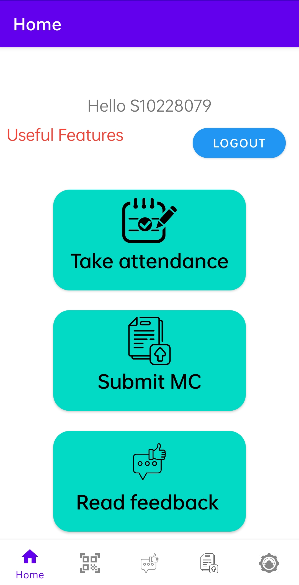

# NPAF - Ngee Ann Poly Attendace Taking and Feedback

Download App on: https://play.google.com/store/apps/details?id=sg.edu.np.mad.madassignmentgrpanpaf

Team Member Name and Student ID 

 Ho Min Teck S10228079 

 Lu Junxi    S10219098 

 Lee Wei Jun Nicholas S10222425 

 Hanisah Binte Musrin S10226112

 Description of the App: 

    Created for NGEE ANN POLYTECHNIC lecturers and students.
    
    Attendance taking always takes a long time and it wastes tons of paper each day! Be able to take attendance and receieve feedback easily on NPAF! Created for both students and lecturers! 
    
    Key features for students:
    Take attendance after scanning the QR Code generated by their lecturer
    View feedbacks given by lecturers each day
    Submit MC and absent reason for student to submit their MC and state their absent reason.
    View Current Location
    
    Key features for lecturers:
    Upload students to database
    View student's attendance seperated into their various classes
    Provide feedback to students based on their daily performance
    Generate QR Code for students to clock in their attendance
    Reset students attendance for students to clock in their attendance the next day.
    View Student Absence Records for lecturer to view their student absence records.
    View Current Location
    
    
    
    We love feedback! Please email us at S10219098@connect.np.edu.sg if you have any feedback :)

    If you enjoy the app, please leave us a review — it means a lot!
    
    *An assignment for partial fulfilment of the coursework of Mobile Applications Development AY2022/23 in Ngee Ann Polytechnic*
    

 

Contributions of each member:
 

Ho Min Teck

Complete layout pages: 

<ul>
    <li>
      lecturer_login
    </li>
    <li>
      lecturer_main
  </li>
  <li>
    upload_student_name
  </li>
  <li>
    main_activity
  </li>
  <li>
    studentP01-P05 fragments
  </li>
  <li>
     provide feedback
  </li>
  <li>
    ClassViewHolder
  </li>
  <li>
    Student Profile
  </li>
  <li>
    view all students
  </li>
  <li>
    lecturer and student register  
  </li>
  <li>
  SubmitMCandAbsentReason
  </li>
  <li>
  ViewStudentAbsenceRecord
  </li>
  <li>MC Confirmation</li>
  <li>Bottom Navigation menu layout</li>
  <li>Navigation Drawer header and menu layout</li>
  

 <li>
   add background to app 
  </li>
<li>
  complete LecturerMain.java
  </li>
<li>
  complete upload student feature (upload_student_name.java)
  </li>
<li>
  add students.java - class object
  </li>
  <li>
  AbsenceDBHandler
  </li>
  <li>
  Absent.java - class object
  </li>
  <li>
  Submit MC and Absent Reason feature
  </li>
  <li>MC Confirmation</li>
  <li>
  View Student Absent Record feature and AbsenceAdapter 
  </li>
  <li>Bottom Navigation for student</li>
  <li>Navigation Drawer for lecturer</li>
  <li>
complete provide feedback feature
  </li>
<li>
  complete classViewHolder.java
  </li>
<li>
  complete student profile page
  </li>
  <li>
  complete View all students feature and viewAllStudentAdapter
  </li>
  <li>Reset Attendance</li>
</ul>

Lu Junxi

<ul>
    <li>
        Designed storyboard
    </li>
  <li>
    Designed App Logo
  </li>
  <li>
    Design App pictures
  </li>
  <li>
    App Description
  </li>
    <li>
        Readme.md
    </li>
  <li>
    completed student taking attendance feature
  </li>
  <li>
   completed student view feedback feature
  </li>
  <li>
      view current location feature
  </li>
  <li>
      Help to improve on the design for Student and Lecturer Pages
  </li>
   
  

    Complete layout pages:
  

  <li>
    complete studentMain
  </li>
  <li>
    student_take_attendance
  </li>
  <li>
    read feedback layout pages
  </li>
  <li>
    view location layout page
  </li>
  </ul>

Lee Wei Jun Nicholas

<ul>
  <li>
complete AccountDBHandler 
  </li>
<li>
  complete courseClass - class object
  </li>
  <li>complete Course.java</li>
  <li>School.java class</li>
  <li>Staff.java class</li>
  <li>Student class</li>
  <li>StudentClass.java</li>
  <li>LecturerLogin.java</li>
  <li>StudentLogin.java</li>
  <li>Updated lectureLogin.xml</li>
  <li>Updated StudentLogin.xml</li>
  <li>Completed Biometrics Login feature</li>
  </ul>

Hanisah Binte Musrin

<ul>
  <li>complete LecturerMain.java</li>
  <li>complete view student attendance feature (ViewAllStudentAttendance.java)</li>
  <li>complete StudentAttendanceAdapter.java</li>
  <li>StudentAttendanceP01-P05 fragments </li>
  <li>complete studentAttendanceViewHolder.java</li>
  <li>complete layout page for view student attendance (view_all_student_attendance, student_attendance) </li>
  <li>complete layout page for lecturer main </li>
  <li>complete layout page for student attendance fragments</li>
    
  <li>Complete dark/light mode feature implementation</li>
 </ul>
  
 
 Relevant Appendices 

 
 Storyboard: https://xd.adobe.com/view/2242ba5e-4a4b-4eb4-a96e-c24a5e94054f-7711/

 
    Storyboard showcase view: https://xd.adobe.com/view/2242ba5e-4a4b-4eb4-a96e-c24a5e94054f-7711/?fullscreen

Lecturer:

Student:

 Credits: 

<a href="https://www.flaticon.com/free-icons/student" title="student icons">Student icons created by Freepik - Flaticon</a>

<a href="https://www.flaticon.com/free-icons/teacher" title="teacher icons">Teacher icons created by max.icons - Flaticon</a>

<a href="https://www.flaticon.com/free-icons/attendance" title="attendance icons">Attendance icons created by Edi Prast - Flaticon</a>

<a href="https://www.flaticon.com/free-icons/student" title="student icons">Student icons created by Freepik - Flaticon</a>

<a href="https://www.flaticon.com/free-icons/add-user" title="add user icons">Add user icons created by Freepik - Flaticon</a>

<a href="https://www.flaticon.com/free-icons/education" title="education icons">Education icons created by itim2101 - Flaticon</a>

<a href="https://www.flaticon.com/free-icons/students" title="students icons">Students icons created by Freepik - Flaticon</a>

<a href="https://www.flaticon.com/free-icons/student" title="student icons">Student icons created by Freepik - Flaticon</a>

<a href="https://www.flaticon.com/free-icons/students" title="students icons">Students icons created by Freepik - Flaticon</a>

<a href="https://www.flaticon.com/free-icons/people" title="people icons">People icons created by Freepik - Flaticon</a>

<a href="https://www.flaticon.com/free-icons/submit" title="submit icons">Submit icons created by Freepik - Flaticon</a>

<a href="https://www.flaticon.com/free-icons/tick" title="tick icons">Tick icons created by kliwir art - Flaticon</a>

<a href="https://www.flaticon.com/free-icons/absent" title="absent icons">Absent icons created by Freepik - Flaticon</a>

<a href="https://www.flaticon.com/free-icons/qr-code" title="qr-code icons">Qr-code icons created by Eucalyp - Flaticon</a>

<a href="https://www.flaticon.com/free-icons/password" title="password icons">Password icons created by Smashicons - Flaticon</a>

